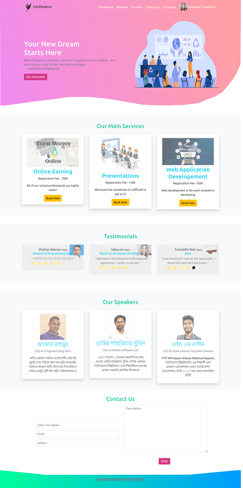
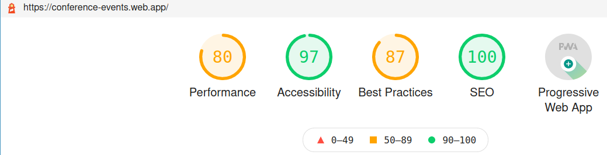
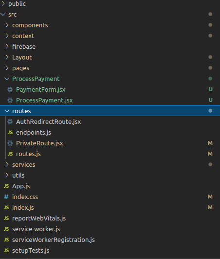

        

### Live URL :https://conference-events.web.app :heart:

### Server URL: https://conference-events.herokuapp.com

## Server Source Code: https://github.com/Porgramming-Hero-web-course/complete-website-server-samayun

Review this project on twitter (
<a href="https://twitter.com/intent/tweet?text=What an application ! Wow !Check It =>  :&url=https://sobji-dokan.web.app" target="_blank">

</a>
)

# Admins

- Email : programminghero001@gmail.com
- Email: samayun.m.chowdhury@gmail.com

# Features

- User can register for available services
- Review Company
- User & Admin Dashboard Panel
- User can order via Stripe Payment Gateway ( MasterCard , VISA Supported )

# Extra Features

- Rating System
- Theme in Dashboard ( two color & left-right sidebar layout applied)

# :clap: Output

- HomePage :
  

- Lighthouse Report :
  

- Project Structure :
  
- Responsive on Mobile

  

# How to run this project

- `git clone https://github.com/Porgramming-Hero-web-course/complete-website-client-samayun.git conference-events`
- `cd conference-events`

* If yarn is not installed yet . run command `npm install -g yarn`

- `yarn` (will install all node packages [INTERNET Connection Need])
- rename `.default.env` to `.env`
  & give proper credentials [environment variable]
  For assignment purpose I gave my credentials in .default.env
- `yarn start`

# Install Packages

- `yarn add axios react-router react-router-dom`
- `yarn add firebase beauty-stars"`
- `yarn add react-hook-form dotenv react-spring config`
- `yarn add @stripe/react-stripe-js @stripe/stripe-js`

# :smile: Features (Technical)

- 3 Tier Architechture
- Lazy loading component (route-based)
- Progressive Web Apps
- Social Authentication ( Google),GitHub )
- Firebase Authentication (Login,LogOut,SignUp)
- Routing including `<PrivateRoute/>`
- State Management (Context API)
- React Hook
- File Upload (Base64)
- Proper Error Handling
- Payment Gateway (Stripe)
- Admin Dashboard

# Used Technolgies & Services

- Boostrap
- service worker
- React + React Router
- Nodejs (Express.js Framework)
- Firebase
- Heroku

:heart: Happy Coding :clap: 🚀

